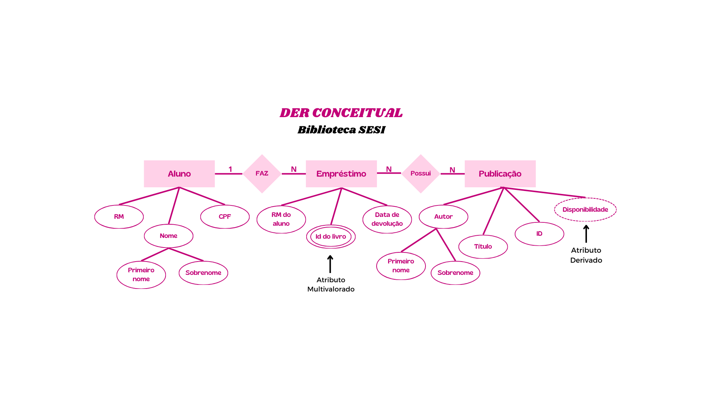

# DER Conceitual - Biblioteca

| Entidade | Atributo | Tipo | Tamanho | Descrição |
| --- | --- | --- | --- | --- |
|Aluno|RM|int|100|Identificador do aluno|
|Aluno|nome|varchar||Nome completo do aluno|
|Aluno|CPF|int|100|Identificador do aluno|
|Empréstimo|RM_aluno|int|100|Identificador do aluno|
|Empréstimo|ID_livro|int|100|Identificador da publicação emprestada|
|Empréstimo|data|Date||Data de devolução do empréstimo|
|Publicação|ID|int|100|Identificador da publicação|
|Publicação|título|varchar||Nome da publicação|
|Publicação|autor|varchar||Nome do autor da publicação|
|Publicação|disponibilidade|int|100|Disponibilidade das publicações no acervo|